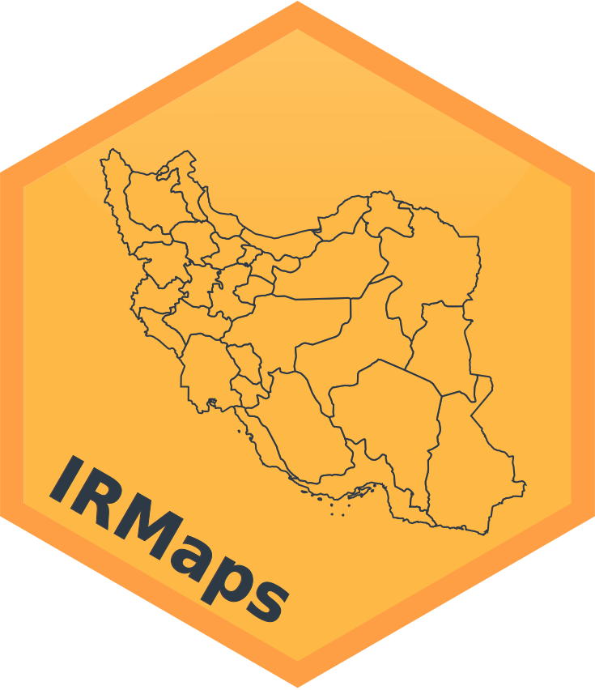
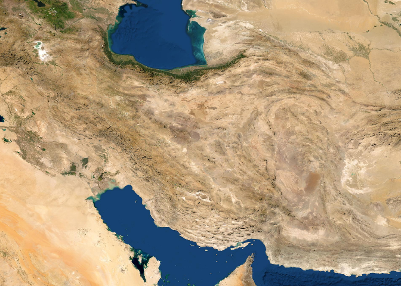
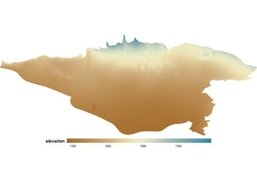
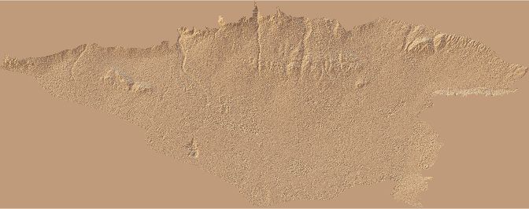

<!-- README.md is generated from README.Rmd. Please edit that file -->

<a href={https://github.com/Ehyaei/IRMaps}>

# IRMaps

[](https://github.com/Ehyaei/IRMaps)
[](https://lifecycle.r-lib.org/articles/stages.html#experimental)
[](https://github.com/Ehyaei/IRMaps/commits/main)

The goal of `IRMaps` is to prepare geographical maps and divisions of
Iran.

## Installation

You can install the development version of IRMaps from
[GitHub](https://github.com/) with:

``` r
# install.packages("devtools")
devtools::install_github("Ehyaei/IRMaps",subdir = "r-package")
```

## Available Maps

The following maps in the form of sf object, are included in the
package.

-   Province (استان)
-   Country (شهرستان)
-   District (بخش)
-   City (شهر)
-   Rural District (دهستان)
-   Geographical Features (عوارض جغرافیایی)

``` r
library(IRMaps)
library(ggplot2)
library(dplyr)

provinces <- irProvinces()
counties <- irCounties()
districts <- irDistricts()
rurals <- irRurals()

map_Plotter <- function(map){
  ggplot(map)+
  geom_sf(aes(fill = area), size = 0.1, color = "white") +
  scale_fill_map(palette = "TealRode")+
  theme_map()+
  theme(legend.position = "none")+
  fullView()
}
gridExtra::grid.arrange(
  map_Plotter(provinces), map_Plotter(counties),
  map_Plotter(districts),map_Plotter(rurals),
                        nrow = 2)
```


``` r
data_map <- merge(provinces, IRMaps::iran_population, by.x = "name_en", by.y = "Province") 
ggplot(data_map,aes(fill = RuralareasMale/RuralareasFemale))+
  geom_sf(color = "white",size = 0.1)+
  scale_fill_map(palette = "TealRode")+
  labs(fill = "Gender Ratio")+
  theme_map()+
  fullView()
```


## Add Raster Tiles

``` r
raster_tile <- get_raster_tile(iran_border, provider = "Esri.WorldImagery",zoom = 7)
ggplot() +
  geom_raster(data = raster_tile, aes(x, y, fill = hex)) +
  scale_fill_identity() +
  theme_map()+
  fullView()
```



## Download map vectors from OSM

``` r
Tehran = districts[districts$name_en == "Tehran",]
osm_theran = get_osm_tile(Tehran)
ggplot()+
  geom_sf(data = Tehran, color = "#FE9F45", fill = "#FE9F45")+
  geom_sf(data = osm_theran$osm_lines, color = "black", size= 0.2)+
  theme_map()+
  fullView()
```


## Download Elevation Data

``` r
tehran = rural[rural$name_en == "Tehran", ]
dem_tehran = get_elevation_tile(tehran, 12)
ggplot(dem_tehran, aes(x, y, fill = elevation))+
  geom_raster()+
  theme_map()+
  fullView()+
  scale_fill_map(palette = "Earth")+
  coord_fixed()
```



``` r
library(rayshader)
library(reshape2)
acast(dem_tehran, x~y, value.var="elevation") -> elmat
elmat[,ncol(elmat):1] %>%
  sphere_shade(texture = "desert") %>%
  plot_map()
```



## Cooperation Request

If you have a map of Iran or demographic data, please let us know so we
can add it to the package.

## Attribution

The following packages have been used in creating IRMaps. Many thanks to
their creators.

-   Simon Garnier’s [viridis](https://github.com/sjmgarnier/viridis)
-   riatelab’s [maptiles](https://github.com/riatelab/maptiles)
-   Jeffrey W Hollister’s [elevatr](https://github.com/jhollist/elevatr)
-   rOpenSci’s [osmdata](https://github.com/ropensci/osmdata)
